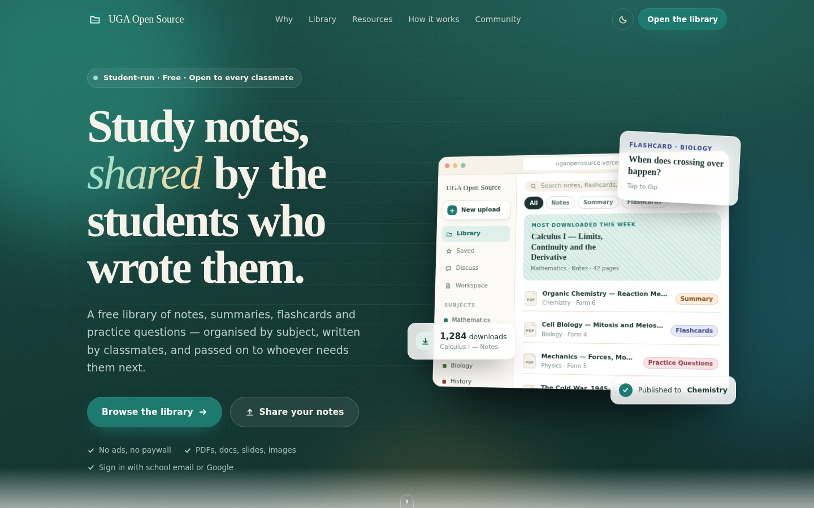

# UGA Open Source — landing showcase

A cinematic, interactive landing page for [UGA Open Source](https://ugaopensource.vercel.app),
the student-run library of notes, summaries, flashcards and practice questions.



A prebuilt, self-contained copy of the page is at [`uga-open-source-landing.html`](uga-open-source-landing.html). Open it straight in a browser; no install needed.

The whole page is one React component — [`src/UGAOpenSourceLanding.jsx`](src/UGAOpenSourceLanding.jsx) —
with its styles in [`src/landing.css`](src/landing.css). There are no runtime dependencies beyond React.

## Run it

```bash
npm install
npm run dev            # http://localhost:5173
npm run build          # production build → dist/
npm run build:single   # one self-contained HTML file → dist-single/index.html
```

## Using the component elsewhere

Copy both files into any React 18+ app:

```jsx
import UGAOpenSourceLanding from './UGAOpenSourceLanding.jsx';

<UGAOpenSourceLanding
  appUrl="https://ugaopensource.vercel.app"          // every CTA links into the live app
  liveStats={{ materials: 312, students: 540 }}       // optional: from the app's site_stats() RPC
/>
```

The page also needs the Lora font (see `index.html`).

## Brand

Colours, type and copy are taken from the production app's source, not guessed:

- **Palette:** the app's design tokens (`src/styles/tokens.css`). One green accent `#1d7a6e` on warm
  cream paper, and a deep green-black for dark mode. The page follows the system theme and has a toggle.
- **Subject hues:** the eight two-tone pairs from `lib/hues.ts`. They colour the folders, badges and
  marquee.
- **Type:** Lora for display text and the system sans for body text, as in the app.
- **Content:** the subjects, sample materials and discussion threads come from the app's seed data. The
  headline, guidelines and disclaimer are the app's own wording.

## What's on the page

| Section | Interaction |
| --- | --- |
| Hero | Headline animates in word by word. The app mock tilts with the cursor, and the floating cards move at three parallax depths. Scroll parallax and a magnetic CTA with a click ripple. |
| Subject marquee | Infinite scroll that pauses on hover |
| The problem | "Group chat → UGA Open Source": nine badly named files rearrange themselves into subject folders when the section scrolls into view, and you can toggle back and forth |
| Browse by subject | Eight folder cards with a cursor spotlight. Type filters with live counts, rows that animate in, a preview modal (Esc and focus trap), and an empty state that asks for an upload |
| Resource types | Keyboard-navigable tabs with a working mini-demo for each: notes that write themselves, a one-page summary, a 3D flip-card deck and a multiple-choice quiz with workings |
| How it works | A four-step walkthrough that advances on its own and pauses on hover or focus. Each step has a small animated screen |
| Features | Bento grid with cursor spotlight and hover lift |
| Stats | Counters that count up (the `$0` counts *down*). `liveStats` adds real totals |
| Community | Real sample threads and a guidelines accordion |
| Final CTA and footer | "I need notes / I have notes" glass cards with floating file chips |

## Performance and accessibility

- Transform and opacity animations only. One rAF-throttled scroll handler and one shared
  `IntersectionObserver` for scroll reveals.
- `prefers-reduced-motion` turns every animation into a static end state.
- Semantic landmarks, a skip link, ARIA tabs, listbox, dialog and `aria-expanded` states, visible focus
  rings, and `aria-live` for the quiz and flashcard counter.
- Tested at 390px and 1440px in light and dark mode, with no horizontal overflow.
